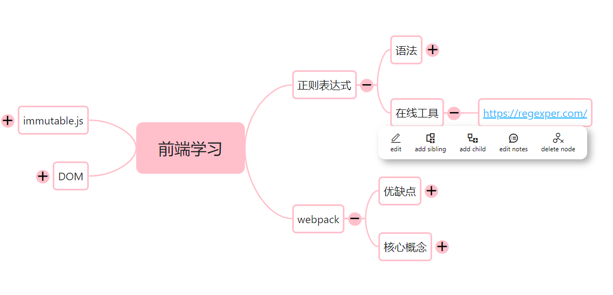

# blink-mind-react
<a href="https://github.com/awehook/blink-mind-react"></a>
[](https://www.npmjs.com/package/blink-mind-react)

A mind map library for react  write in  typescript which use immutable.js for state management.

The mind map can drag to any area of the view container area. 

Editing a node with a rich text editor.

I have created app use this library.

https://github.com/awehook/react-mindmap

The online demo is [react-mindmap](https://awehook.github.io/react-mindmap/)

### Futures
1. drag and move


2. drag and drop for reorganize the node relationship


3. popup menu for operation the node



4. rich text editor for mind map item


### Usage
In your project, run the command
```
yarn add blink-mind-react
```

I have created a sample app to demonstrate how to use this library.

[The main code](https://github.com/awehook/react-mindmap/blob/master/src/component/MindMap.js) 

### Run the Demo
```
yarn
yarn storybook
```
Then open http://localhost:6006/ .
Click the demo1 menu item.


### Dependency

This library integrate the [rich-markdown-editor](https://github.com/outline/rich-markdown-editor) which url is https://github.com/outline/rich-markdown-editor.
I have modified some code of rich-markdown-editor.
And this library used the library which forked from [rich-markdown-editor](https://github.com/outline/rich-markdown-editor) and modified some code by me.
The forked library's url is https://github.com/awehook/rich-markdown-editor.
